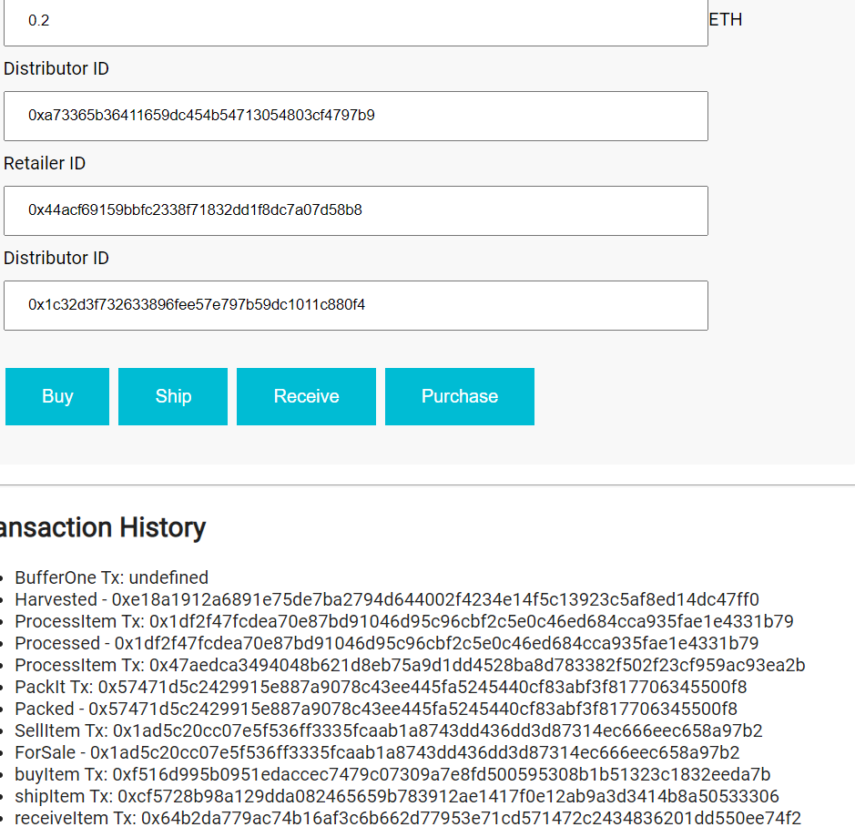

"# Coffee-SupplyChain" 
This is a Supply Chain Managment blockchain Dapp on Ethereum.

## This project was built using the following framework versions:

Truffle v5.3.10 (core: 5.3.10)
Solidity v0.5.16 (solc-js)
Node v14.17.0
Web3.js v1.3.6

## IPFS Details

IPFS was not used in this project.

## Rinkeby Network: Supply Chain Contract Address

The Supply Chain Contract Address on Rinkeby Network: **0xdcc6f8e1f121abe305bd339406ae5b26851db258** and can be viewed on the Rinkeby Etherscan website [here](https://rinkeby.etherscan.io/address/0xdcc6f8e1f121abe305bd339406ae5b26851db258)

## The Supply Chain Contract Transaction Hash on Rinkeby Network: 

**0x5d2e759eef65394aa3514d678e0a00f206f87270e2e71238dc9916837c23e162** and can be viewed on the Rinkeby Etherscan website  [here](https://rinkeby.etherscan.io/tx/0x5d2e759eef65394aa3514d678e0a00f206f87270e2e71238dc9916837c23e162)

## UML Diagrams
NOTE: The _Regulator_ role has not been included in the final solution and that some method names used in the diagrams may be slightly different in the code.

### Activity Diagram

### Sequence Diagram

### State Diagram

### Class Diagram

## Client side app

In order to test the client side application, its necessary to import the different actor roles into your MetaMask and to ensure that each actor role is added to the deployed contract.

### Step 1: Import all actor accounts into your MetaMask

Keep the first account (index 0) as the contract owner and make account 1 - 4 as the actors as follows:

* 0x50b372c142d9fe218c3676a09e02cf7ed37af304 - **Farmer Account**
* 0xa73365b36411659dc454b54713054803cf4797b9 - **Distributor Account**
* 0x44acf69159bbfc2338f71832dd1f8dc7a07d58b8 - **Retailer Account**
* 0x1c32d3f732633896fee57e797b59dc1011c880f4 - **Consumer Account**

Use the private keys for each of these accounts to add to MetaMask. Optionally rename the accounts to help with testing as shown below:

### Step 2: Test the client app in your local browser + MetaMask

Now open the app and in MetaMask select the Farmer account. Now interact with the app, performing the transactions that a Farmer is allowed to perform. Notice that if you try to perform a transaction that a Farmer _cannot_ process there is a transaction error and the approriate message is shown in the log. In oder to process the entire flow of the supply chain you will need to switch wallet addresses to the different actor wallets that were imported in Step 1 above to complete the end to end journey through the entire supply chain.

Note that the transaction history contains the events logged for adding the actors to the contract as well as any transactions you have just performed as shown below:
